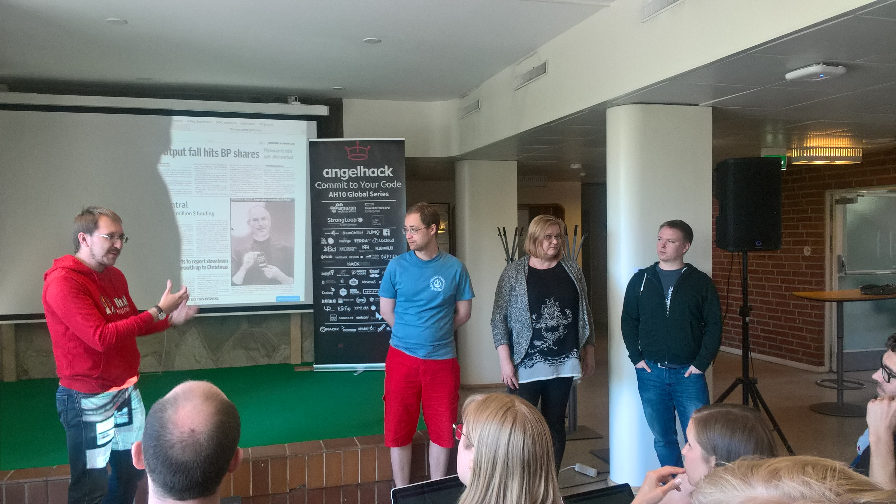

# Startup Name Generator

Name generator for startups

## Description

This projects creates names for startups that have difficulty coming up with their own name.

## Setup

[Clone](https://help.github.com/articles/cloning-a-repository/) the repository to your computer. The requirements.txt file contains the backend requirements, which can be installed with

     pip install.txt

After the dependencies have been installed, the program can be run with

     python service.py

Open a web browser and go to http://127.0.0.1:5000/ to see the webpage and get the name for your new hot startup.

## Technologies

Backend: [Python](https://www.python.org/), [Flask](flask.pocoo.org/), [Jinja2](jinja.pocoo.org/), [PIL](http://www.pythonware.com/products/pil/)

Frontend: [HTML](https://developer.mozilla.org/en-US/docs/Web/HTML), [CSS](https://www.w3schools.com/css/), [Bootstrap](getbootstrap.com/), [jQuery](https://jquery.com/)

Names are generate [here](http://burgundy.io/)([source](https://github.com/shariq/burgundy)) where  recurrent neural networks are used to create pronounceable names. The pronounceability of the words is based on a Markov chain model built on the basis of the 20k most common words in the English language, the assumption being that more common a word is, the more easy it is to pronounce.

## Credits

Project based on an idea by [Kirill Soloviev](https://github.com/double-u-d), service design by Eevastiina Rindell, frontend coding by [Jere Suikkila](https://github.com/jeresuikkila) and backend/frontend coding by [Omar El-Begawy](https://github.com/gellati)

This was a project for the [Helsinki AngelHack 27-28.5.2017](http://www.hackathon.io/angelhack-global-hackathon-series-helsinki).

